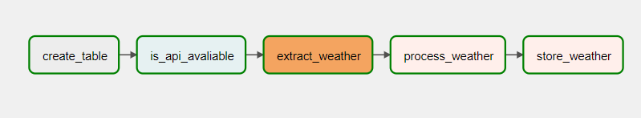

DAG creation in airflow, for data pipeline, extracting data from an API and storing the data in a Postgres database

  
    

API - weather-api 
 
Documentation - https://github.com/robertoduessmann/weather-api
 
Api URL - https://goweather.herokuapp.com/weather/{city}

Dag Tasks in Airflow:
Create_table: create a postgres table with temperature, wind, description columns
is_api_avaliable: uses an HTTP sensor to check if api is available
extract_weather: GETs the api to extract the information from it and returns a json
process_weather: calls a function to process the incoming json and then it is saved in .CSV
store_weather: save the JSON to the database